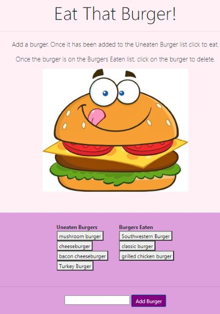

# Burger App 

## Deployed Website: 

https://desolate-wave-36352.herokuapp.com/

* [Check out this video of the app for a run-through of how it works](https://youtu.be/msvdn95x9OM)

### Overview

This is the first Full-Stack App I have created. This burger logging app uses MySQL, Node, Express, Handlebars and a homemade ORM (yum!). It also applies the MVC design pattern. 

### Before You Begin

* Eat-Da-Burger! is a restaurant app that lets users input the names of burgers they'd like to eat.

* Whenever a user submits a burger's name, your app will display the burger on the left side of the page -- waiting to be devoured.

* Each burger in the waiting area also has a `Devour it!` button. When the user clicks it, the burger will move to the right side of the page.

* Your app will store every burger in a database, whether devoured or not.

